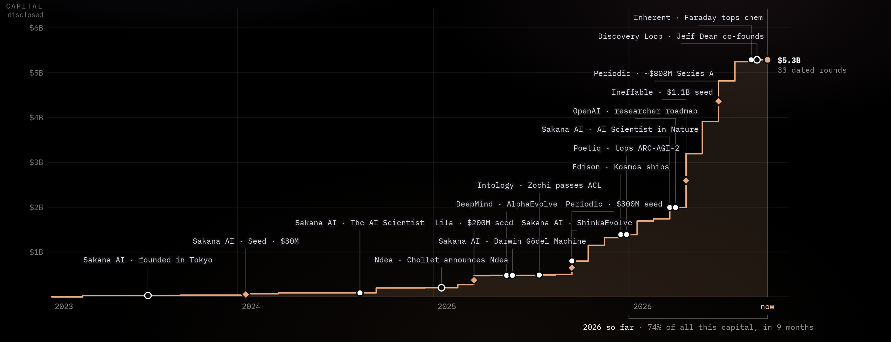

<a href="https://rsi-list.com"></a>

<h1 align="center">&nbsp; RSI List</h1>

A cited directory of the organizations working toward recursive self-improvement: AI that improves the process of building AI. 42 entries, each graded on what it has publicly demonstrated, with a dated source behind every figure.

**Live page:** https://rsi-list.com

## The takeoff

<a href="https://rsi-list.com"></a>

Disclosed rounds across the field on one time axis, with shipped results (●), company launches (○) and named rounds (◆) placed along the curve. The early results shipped while the funding curve was still flat; the money came afterwards, most of it in 2026. Only dated, disclosed rounds are plotted, and frontier-lab capital is left out.

## What it covers

No company has closed the loop yet, and claims in this field run ahead of evidence, so every entry is graded on what it has shown rather than what it says. Alongside RSI proper, the list includes the adjacent areas some people count as RSI too:

| Category | What the loop does |
| --- | --- |
| **Auto research** | AI runs the whole research loop. |
| **Self-improvement** | The output flows back into the system itself, as training signal, memory, or better workflows. |
| **RSI** | What the output improves is the model's ability to improve itself. |

Ranked entries (#1–15) clear a scale / recognized-evidence / team bar; earlier-stage teams sit on the radar (◎) unranked. Every figure carries a confidence tag (● confirmed, ◐ reported, ○ estimated) and a dated source linked from the entry.

The site has three parts:

- **The takeoff chart** above, at the top of the page.
- **The directory**: a table or card view of every organization, sortable by rank, capital, valuation and founding year, searchable by name or people, filterable by country.
- **One page per organization**: what the loop is, the flagship, the team, every figure with its confidence tag and source.

Each entry also carries **tags** for what the company actually builds. Five tags, any number per company:

| Tag | What it covers |
| --- | --- |
| **Model** | Frontier / foundation model work |
| **Harness** | Agents, scaffolds, the loop around the model |
| **Infra** | Compute and training infrastructure |
| **Data/Eval** | Data pipelines, benchmarks, evaluation |
| **Applications** | Products built on top of the models |

## Repository

`index.html` is the entire site: one self-contained file with no build step and no dependencies. Open it directly in a browser, or serve the directory statically.

```
python3 -m http.server 8000      # then open http://localhost:8000/
```

The data lives in the `DATA` array in the inline script at the bottom of the file. Each entry carries its own sources, so a change to a number should come with a change to the source beside it. The events on the takeoff chart live in the `FIELD_EVENTS` array further down the same script.

Tags are data, not UI: the page reads them from `data/tags.json`. To edit them, run the tag server and click the chips in the table:

```
python3 tools/tagserver.py --port 10045     # then open http://localhost:10045/
```

Every click is written through to `data/tags.json`, with one append-only line per change (who, when, before, after) in `data/tags-log.jsonl`. The deployed site ships `tags.json` as a read-only snapshot.

The two images in this README are rendered from the site itself, not hand-made. After a data update, regenerate them with:

```
python3 tools/render_cover.py            # needs playwright + chromium; writes assets/cover.jpg and assets/takeoff.png
```

## Contributing

Corrections and additions are welcome. Open an issue or a pull request, and include a dated primary source for anything quantitative: a round, a valuation, a headcount, a shipped result.

## Credits

Built and maintained by [Jinyan Su](https://jinyansu1.github.io), [Jiabin Tang](https://tjb-tech.github.io/), and [Yu Shi](https://x.com/chadshi_1).

Format inspired by [RL List](https://www.rl-list.com).

## License

Code is released under the [MIT License](LICENSE). The dataset (entries, figures, timelines, sources, and tags) is licensed under [CC BY 4.0](https://creativecommons.org/licenses/by/4.0/); attribute as "RSI List (rsi-list.com)".
